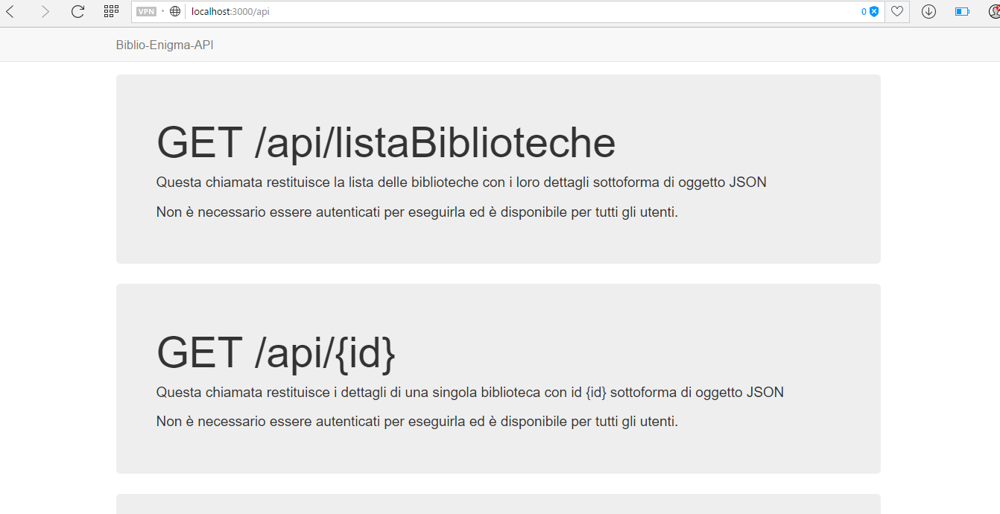

# biblio-enigma-server
This repo contain the project for " Network comunications" - Sapienza Univ. of Rome ay2016/2017

E' possible provare e testare il progetto in tutte le sue funzionalità all'indirizzo http://demo.nicholasgiordano.it:3000

Nella seguente repository e possibile trovare il progetto per Reti di Calcolatori. 
Il progetto svolge il seguente servizio: si occupa di gestire i posti disponibili nelle sale lettura delle biblioteche del nostro ateneo. 
Ongi volta che viene registrato uno studente in entrata o in uscita da una biblioteca viene inviata una notifica push tramite web. 
E' possibile iscriversi a queste notifiche visitando la pagina di. test http://demo.nicholasgiordano.it/biblionotifiche
E' possibile iscriversi anche alle notifiche utilizzando un ipotetico client di test che utilizza le api offerte da questo servizio all'indirizzo http://demo.nicholasgiordano.it/biblio-enigma-client
E' possibile consultare il codice del client di test all'indirizzo https://github.com/nicholas0/biblio-enigma-client

#Quali servizi sono resi disponibili tramite rest?
* conoscere informazioni generiche sulle biblioteche gestite
* conoscere lo stato dei posti occupati nelle singole biblioteche
* catturare commenti degli utenti sui social relativi ad una delle biblioteche
* suggerire musica/libri/film relativamente ad un libro
* segnalare uno studente in entrata in una biblioteca (nuovo posto occupato)
* segnalare uno studente in uscita da una biblioteca (nuovo posto libero)

#Api esterne utilizate:
* Twitter (per lo status sui social)
* Tastekid (per i suggerimenti basati sul titolo di un libro)
* Onesignal (per l'invio delle notifiche)

#Come avviare il servizio:
Per avviare il servizio basta mandare in esecuzione app.js, realizzata con framework expressjs e in esecuzione sulla porta 3000.

#Utilizzo delle API:
...da scrivere...

Di seguito alcune screen del servizio in esecuzione:
(Per il framework grafico è stato utilizzato jade)

**Se si va su host:3000**

**Se si va su host:3000/api**

	
