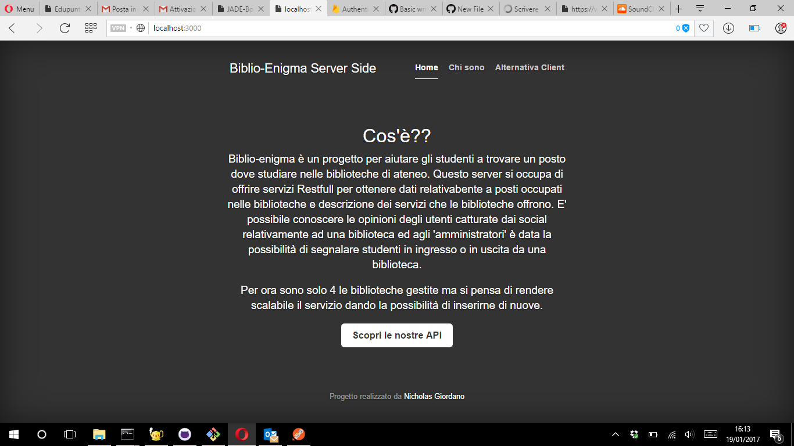
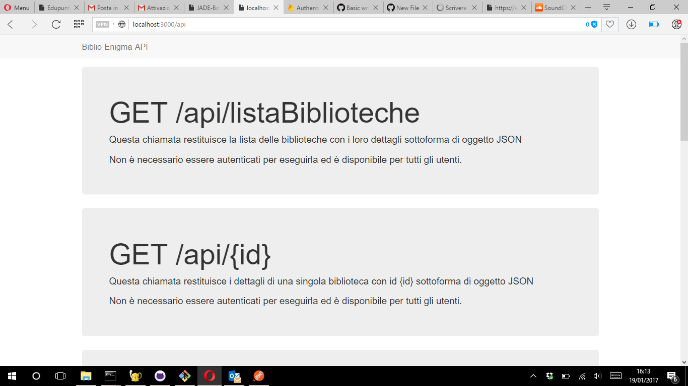

# biblio-enigma-server
This repo contain the project for " Network comunications" - Sapienza Univ. of Rome ay2016/2017

Nella seguente repository e possibile trovare il progetto per Reti di Calcolatori. Il progetto svolge il seguente servizio: si occupa di gestire i posti disponibili nelle sale lettura delle biblioteche del nostro ateneo. Il servizio implementa api rest che possono eseguire i seguenti compiti

#Quali servizi sono resi disponibili tramite rest?
* conoscere informazioni generiche sulle biblioteche gestite
* conoscere lo stato dei posti occupati nelle singole biblioteche
* catturare commenti degli utenti sui social relativi ad una delle biblioteche
* suggerire musica/libri/film relativamente ad un libro
* segnalare uno studente in entrata in una biblioteca (nuovo posto occupato)
* segnalare uno studente in uscita da una biblioteca (nuovo posto libero)

#Api esterne utilizate:
* Twitter (per lo status sui social)
* Tastekid (per i suggerimenti basati sul titolo di un libro)

#Come avviare il servizio:
In base alle esigenze è possibile avviare il servizio in maniera completa (realizzato totalmente con framework expressjs) o in maniera "server" mettendo a disposizione i singoli endpoint delle api.

* Nella cartella 'Comlete App' è posibile trovare la versione completa del progetto, che va in esecuzione sulla porta 3000 e fornisce oltre ai servizi rest un'interfaccia grafica di spiegazione e una home page
* Nella cartella 'Server Rest' è invece possibile trovare la versione senza interfaccia grafica che mette a disposizione solamente i servizi di rest

Di seguito alcune screen del servizio in esecuzione completo:

**Se si va su host:3000**

**Se si va su host:3000/api**

	
